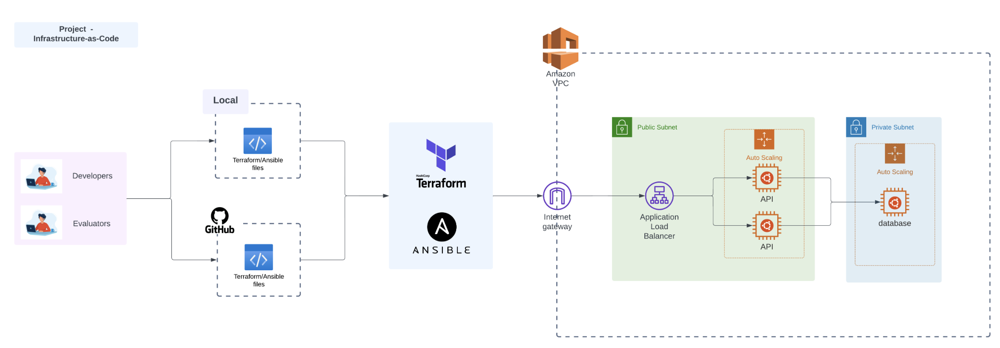

# Infrastructure Provisioning Automation

This project contains a terraform script to provision an AWS vpc, a public subnet with 2 nodes, a private subnet with a database that can communicate with each other.

# Architecture



# Prerequisites

- [Terraform](https://www.terraform.io/downloads.html) (version 0.15.0)
- [AWS CLI](https://aws.amazon.com/cli/) (optional, version 2.2.0)

### Installation

1. Install Terraform: [Terraform Installation Guide](https://learn.hashicorp.com/tutorials/terraform/install-cli)
2. Install AWS CLI (optional): [AWS CLI Installation Guide](https://docs.aws.amazon.com/cli/latest/userguide/install-cliv2.html)

# How to run

- Export your env variables or create them in .tfvars
- To run

```sh
$ terraform plan
$ terraform apply --auto-approve
```

- To destroy after

```sh
$ terraform destroy --auto-approve
```

# URL to public GitHub repo

https://github.com/LaraTunc/we-cloud-2-terraform
